## 演示截图

* 登录界面

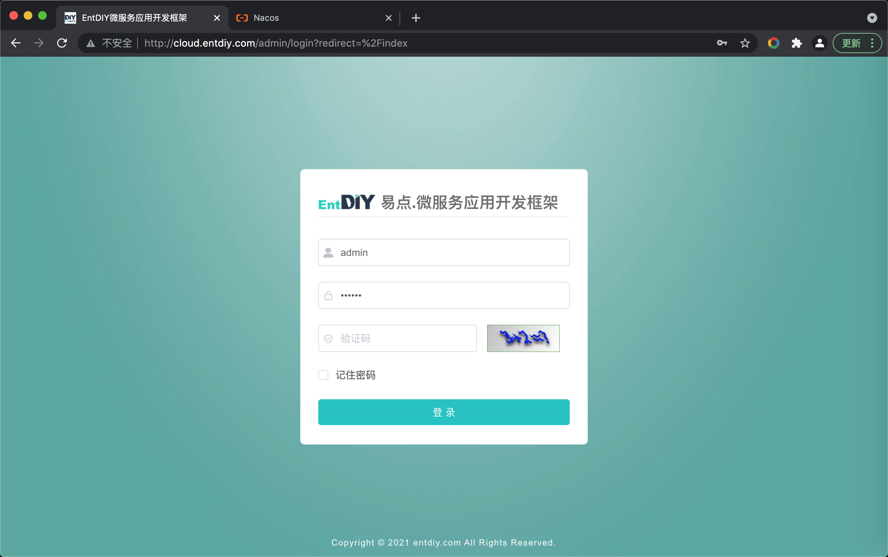

* 系统主界面

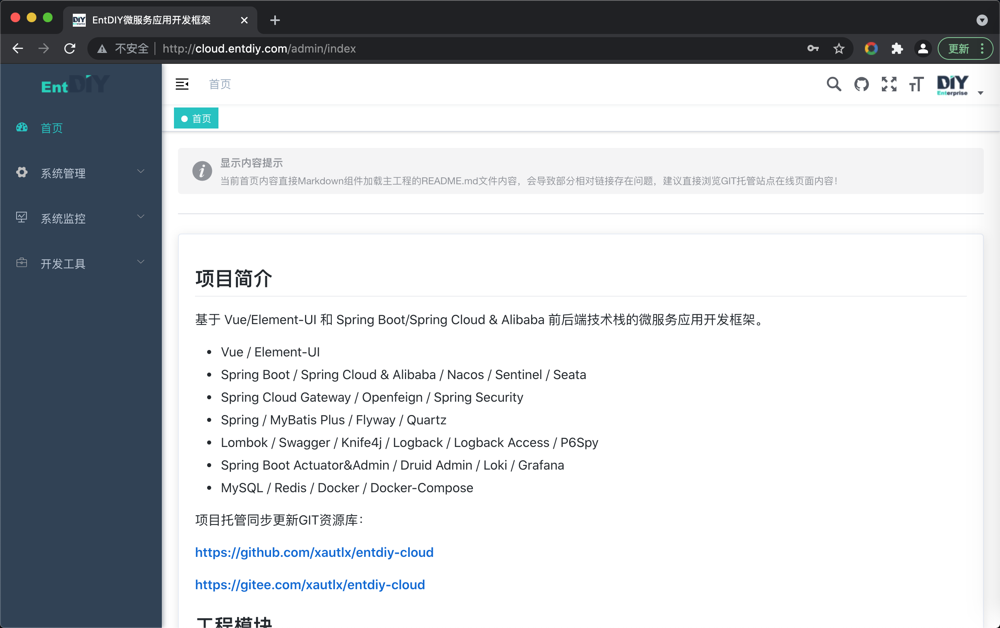

* 菜单管理

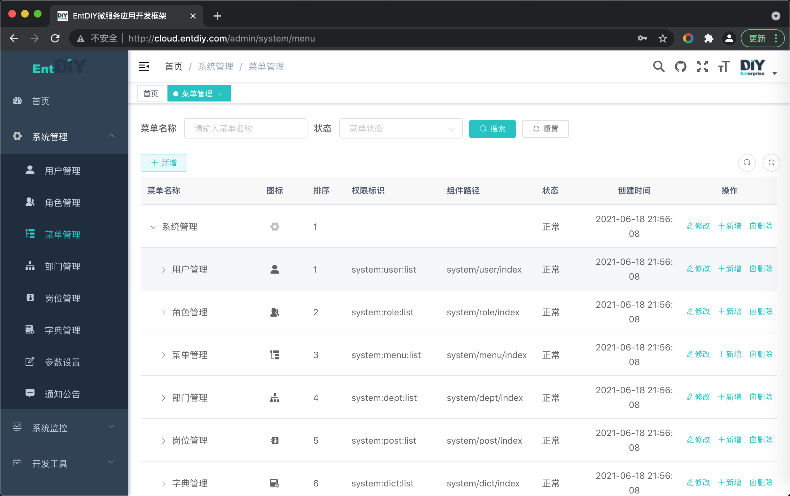

* Swagger接口文档集成

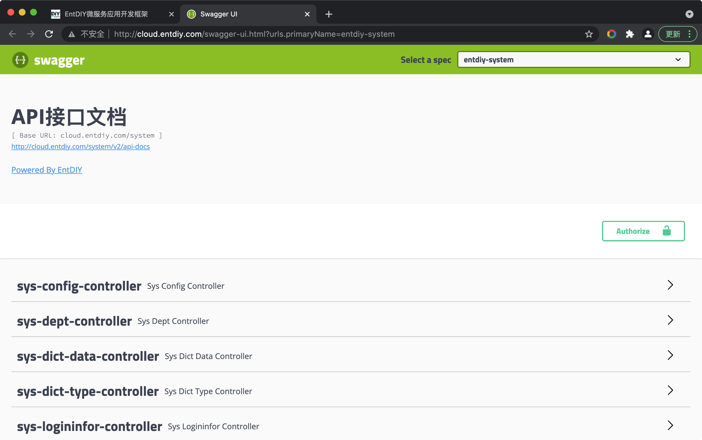

* Knife4j接口文档集成

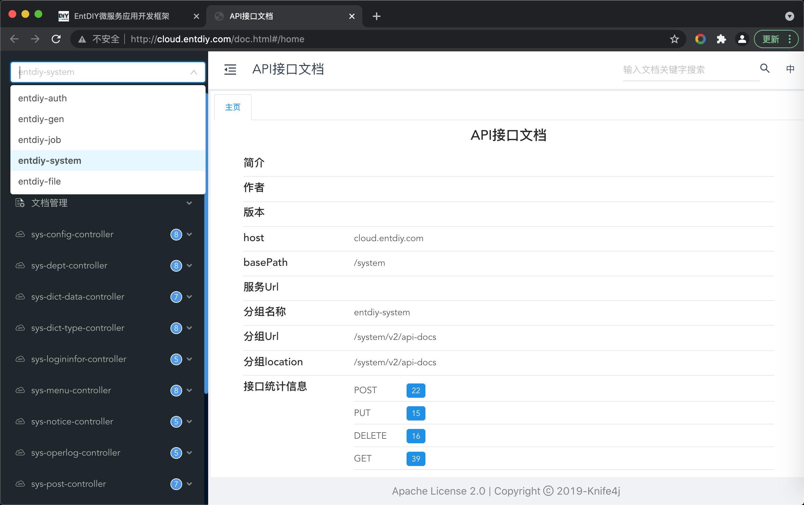

* 运维管理

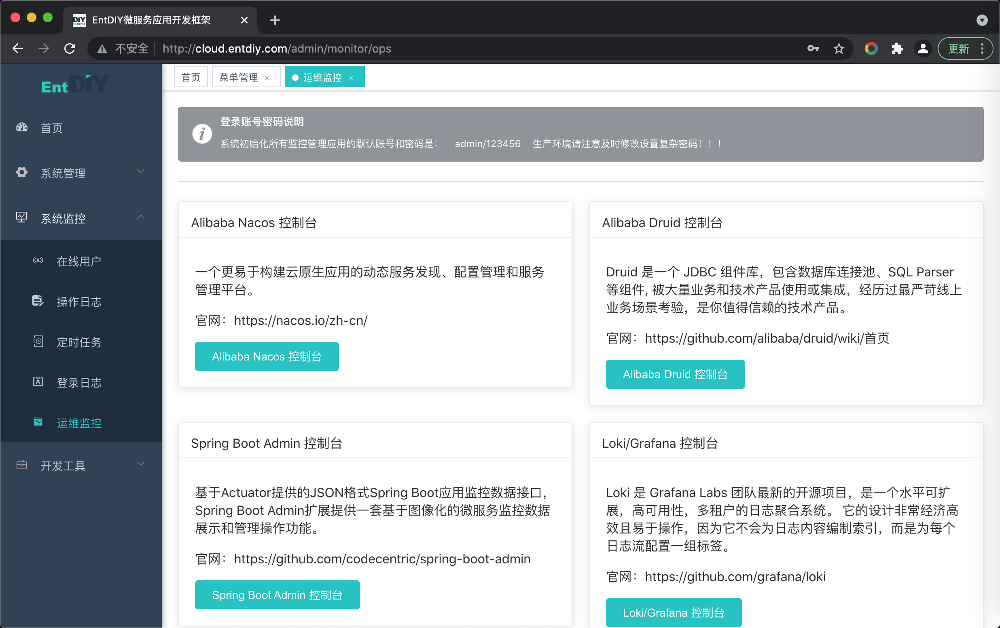

* Nacos配置管理

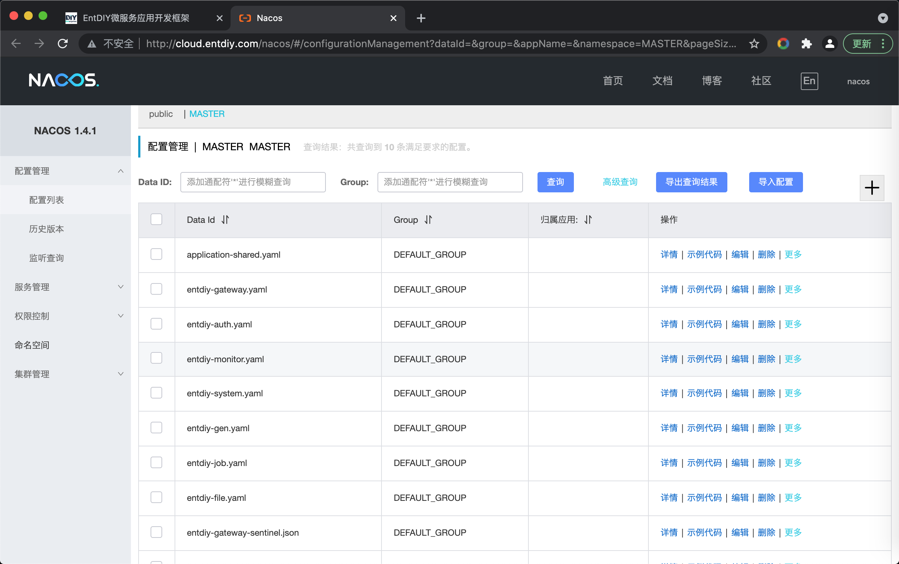

* Nacos服务管理

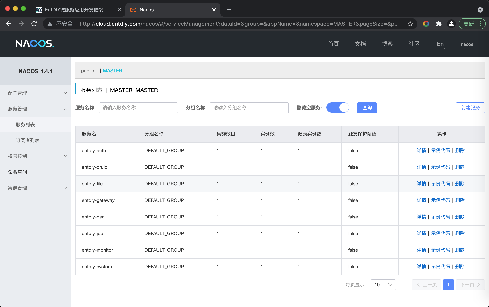

* Spring Boot Admin监控

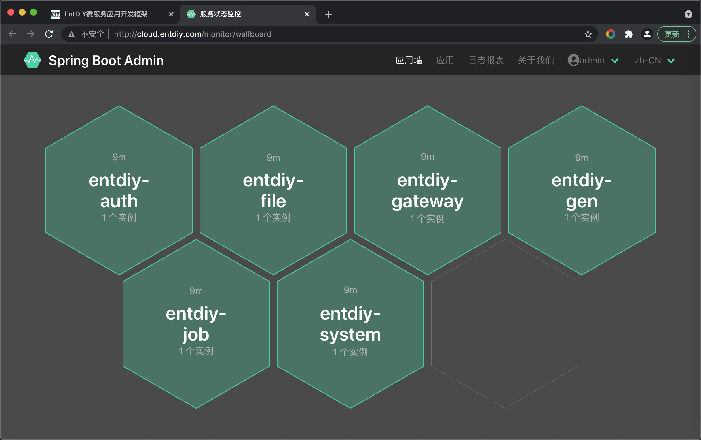

* Spring Boot Admin监控

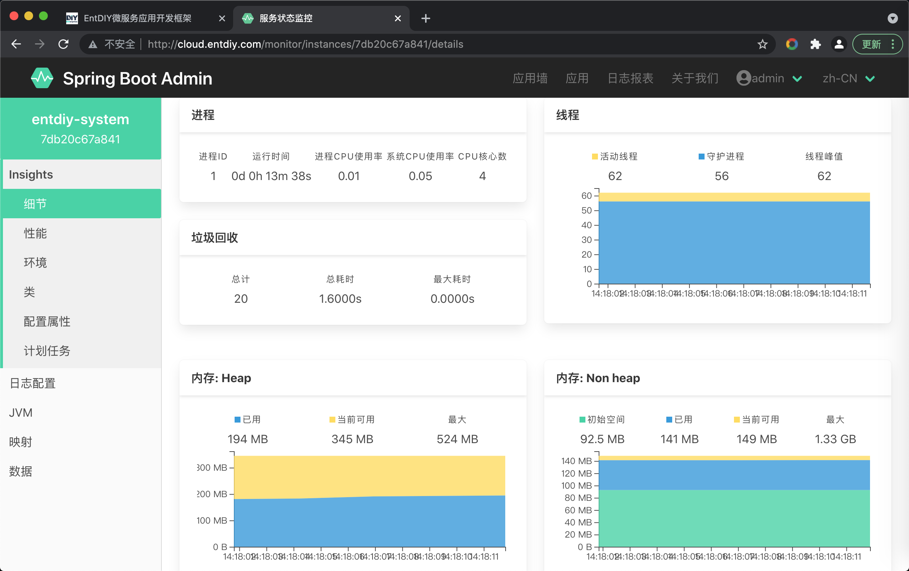

* Spring Boot Admin监控

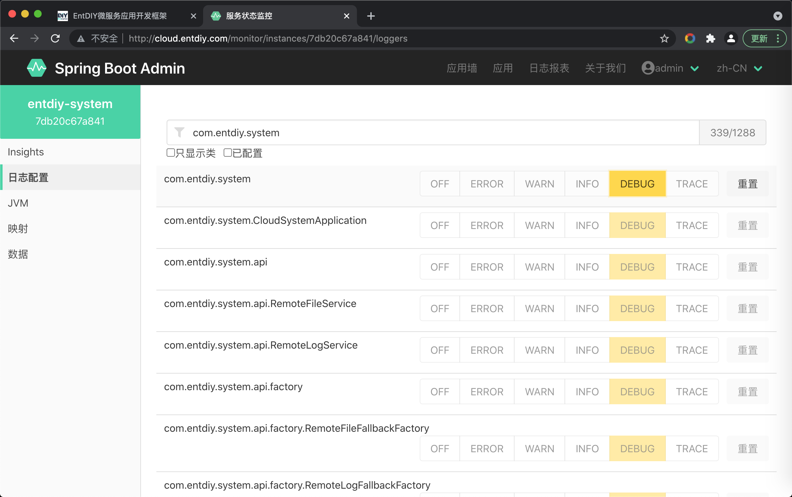

* Druid SQL/Web监控

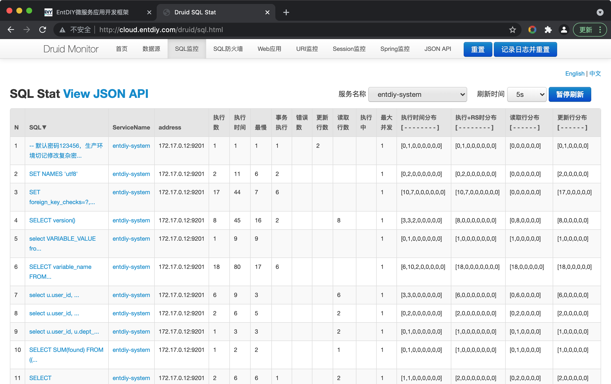

* Druid SQL/Web监控

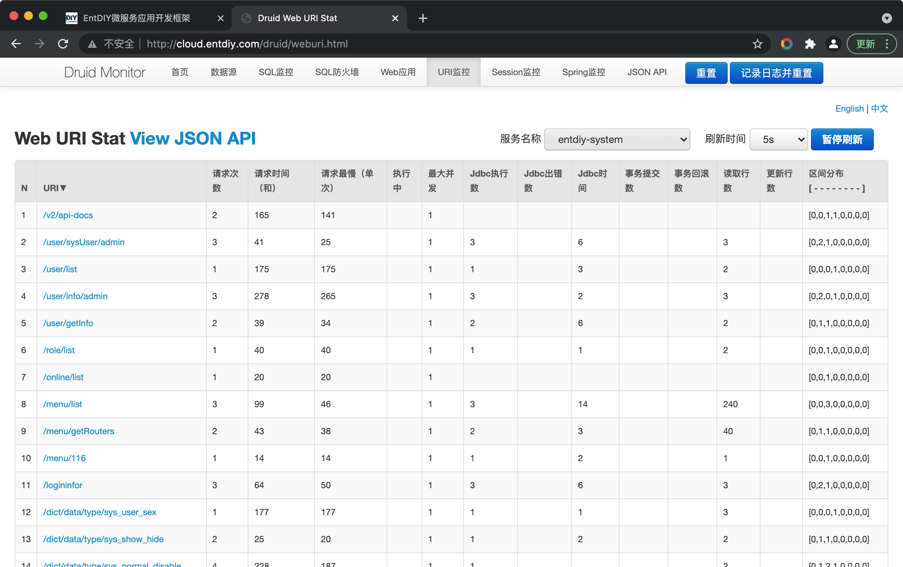

* Loki/Grafana日志聚合

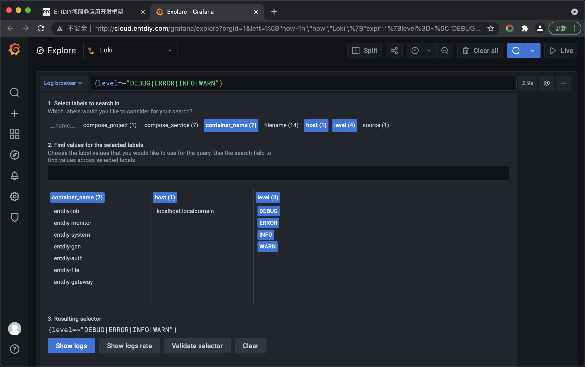

* Loki/Grafana日志聚合

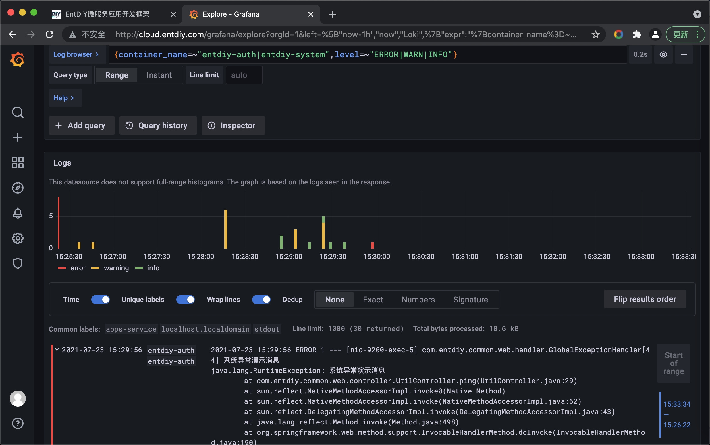
